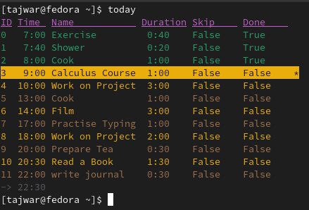
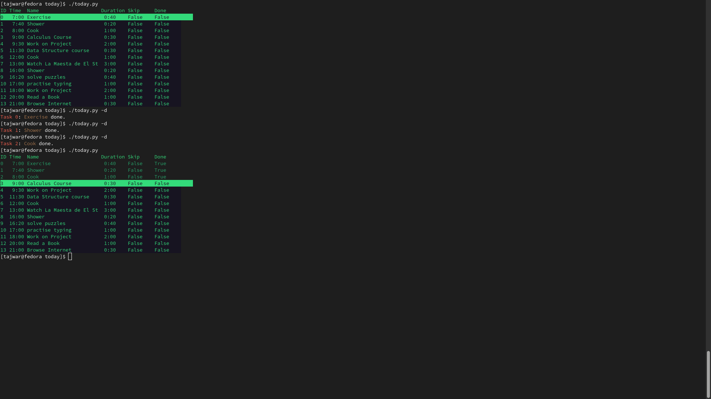

# today

**A command line program to help you plan your day and execute it in an organised way**





Screenshots taken on Gnome Terminal.

# Getting Started

**today** is a Command Line day planner program. The intention of developing this program was to help people plan their whole day and stay organised and productive. This Command Line application will let you have a realistic plan for your day, save your time, and help you stay organised.

*today* has quite a few features. This short introduction will introduce you to basic commands.

To see how to install *today*, scroll down to [installation guide](#Install-today).

You can find the full wiki documentation [here](https://github.com/TajwarHjkl/today/wiki).

## The Help Message

Open your terminal.

To see what we can do with this program, run the command below:

```console
today -h
```

You should see a longer version of this help message:

```
positional arguments:
  ID Name Duration  [int] [str] [time]

options:
  -h, --help        show this help message and exit

Basic Task and Data:
  -a                add/append a new Task [ID][Name][Duration]
  -d                mark done [ID]
  -D                mark undone [ID]
  -r                remove [ID]
  -s                skip [ID]
  -S                unskip [ID]
  -m [ID]           modify [New ID] [New Name] [New Duration]

Modifiers:
  -E                do action for every Tasks
  -i [int]          iterate this number of times
  -I                increment ID by 1 each time
```

This is the shortened version of the help message for *today*. We will only be looking at what we need to know to get started using this program.

## Creating a New Task

Let's say we woke up in the morning and the first task of our day will be to exercise for 40 minutes. But how do we add a new task? Well if you look under the options, you will see one option that starts with `-a` with the message "add/append a new Task [Name] [Duration]".  Let's use that.

```console
today -a Exercise 40m
```

We are calling the program *today* and we are giving it the optional argument `-a` followed by two positonal arguments "Exercise" and "40m".

Now let's check what we added:

```console
today
```

```
ID Time  Name     Duration Skip     Done
0   7:00 Exercise  0:40    False    False    *
```

It worked! Let's add some more tasks.

```console
today -a Shower 20
```

```console
today -a Cook 1h
```

```console
today -a Calculus Course 45m
```

```console
today -a Important Project 3h
```

Now let's check again.

```console
today
```

```
ID Time  Name              Duration Skip     Done
0   7:00 Exercise           0:40    False    False    *
1   7:40 Shower             0:20    False    False
2   8:00 Cook               1:00    False    False
3   9:00 Breakfast          0:15    False    False
4   9:15 Calculus Course    0:45    False    False
5  10:00 Important Project  3:00    False    False
```

## Mark A Task Done

Did you notice that asterisk (*) beside the first task? That indicates that task is the **next** task. If you look at the help message, you will find the option for marking a task as done (it's `-d`). Let's try that.

```console
today -d
```

```console
Task 0: Exercise done.
```

We did not tell the program which task we just did, why did it pick `Task 0`? Because it was the next task on our list. Let's see our day again.

```console
today
```

```
ID Time  Name              Duration Skip     Done
0   7:00 Exercise           0:40    False    True
1   7:40 Shower             0:20    False    False    *
2   8:00 Cook               1:00    False    False
3   9:00 Breakfast          0:15    False    False
4   9:15 Calculus Course    0:45    False    False
5  10:00 Important Project  3:00    False    False
```

Did you notice that `Shower` is now highlighted as the next task? It's the next Task of our day.

## Using ID

But what if we want to mark a specific task as done?

We can pass the `ID` as a positonal argument. Let's say you skipped Shower and went to cook (you stinky!). We can use `today -d` followed by the `ID` of the Task `Cook`.

```console
today -d 2
```

```
Task 2: Cook done.
```

We are getting the hang of this.

## Undo A Task

To undo a done task, you can use the optional argument `-D` the same way as you would use `-d`. If you don't provide any `ID` then the last done task will be undone.

## Skip A Task

If you want to skip a task, you can use `-s` to mark task as skipped. A skipped task won't be highlighted as **next**.

Use `-S` to unskip.

## Remove A Task

`-r` will remove a task.

Be careful, this option is not reversible.

## Learn More

To learn more, please read [the wiki](https://github.com/TajwarHjkl/today/wiki).

# Install today

## Install With Pip

```console
pip install today-cli
```

# Having an Issue?

## command not found

### Debian/Ubuntu

`~/.local/bin` is not on the default Debian/Ubuntu `$PATH`. To fix this issue, run:

```console
echo export PATH="\$HOME/.local/bin:\$PATH" >> .profile
```

Then restart your shell.

### macOS

Please read [this](https://stackoverflow.com/questions/35898734/pip-installs-packages-successfully-but-executables-not-found-from-command-line).

## Any Other Issue?

Please [post here](https://github.com/TajwarHjkl/today/issues/new/choose).
