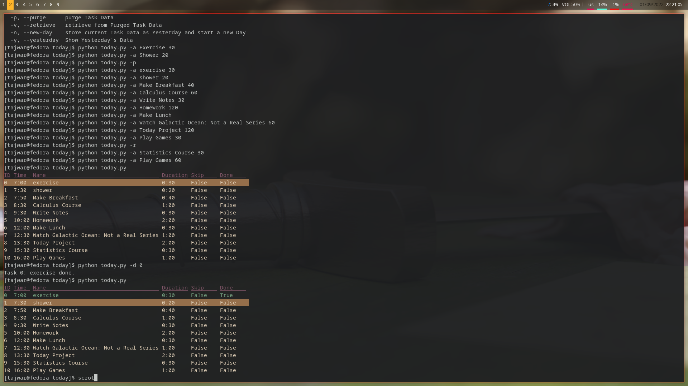

# today

**Add Tasks, reserve time for them, Mark Task Done and Be Organised!**

How is it different from a program such as [Taskwarrior](https://taskwarrior.org/)? **Taskwarrior** is a powerful to do list manager, whereas **today** is a day planner. You can use Taskwarrior to add tasks, make them recurring and add due dates; you can use today to plan what tasks you will be doing today, when you will do them and how much time you are planning on spending on each task.



# Getting Started

`$ python today.py -h`

```
usage: plan and execute your day in an organised way [-h] [-a] [-d] [-u] [-r] [-t] [-da] [-ua] [-p]
                                                     [-v] [-n] [-y]
                                                     [Arguments ...]

positional arguments:
  Arguments        Task ID [int], Name [str], Duration (minutes) [int]

options:
  -h, --help       show this help message and exit
  -a, --add        add/append a new Task [?ID][Name][Duration]
  -d, --done       mark a task as done [ID]
  -u, --undo       mark a task as undone [ID]
  -r, --remove     remove Task [ID]
  -t, --toggle     toggle Skip of Task [ID]
  -da, --done-all  mark all tasks as done
  -ua, --undo-all  mark all tasks as undone
  -p, --purge      purge Task Data
  -v, --retrieve   retrieve from Purged Task Data
  -n, --new-day    store current Task Data as Yesterday and start a new Day
  -y, --yesterday  Show Yesterday's Data
```

`$ python today.py -a exercise 30`

`$ python today.py -a shower 20`

`$ python today.py -a Make Breakfast 40`

`$ python today.py -a Calculus Course 60`

`$ python today.py -a Write Notes 30`

`$ python today.py -a Homework 120`

`$ python today.py -a Make Lunch`

`$ python today.py -a Watch Galactic Ocean: Not a Real Series 60`

`$ python today.py -a Today Project 120`

`$ python today.py -a Statistics Course 30`

`$ python today.py -a Play Games 60`

Now that we have added some tasks, let's see how it looks like.

`$ python today.py`

```
ID Time  Name                                    Duration Skip     Done
0  7:00  exercise                                0:30     False    False
1  7:30  shower                                  0:20     False    False
2  7:50  Make Breakfast                          0:40     False    False
3  8:30  Calculus Course                         1:00     False    False
4  9:30  Write Notes                             0:30     False    False
5  10:00 Homework                                2:00     False    False
6  12:00 Make Lunch                              0:30     False    False
7  12:30 Watch Galactic Ocean: Not a Real Series 1:00     False    False
8  13:30 Today Project                           2:00     False    False
9  15:30 Statistics Course                       0:30     False    False
10 16:00 Play Games                              1:00     False    False
```

The actual program supports terminal colours and next task will be highlighted in a terminal emulator that has colours.

Now, let's say we have finished our first task of the morning.

`$ python today.py -d 0`

```
Task 0: exercise done.
```

`$ python today.py`

```
D Time  Name                                    Duration Skip     Done
0  7:00  exercise                                0:30     False    True
1  7:30  shower                                  0:20     False    False
2  7:50  Make Breakfast                          0:40     False    False
3  8:30  Calculus Course                         1:00     False    False
4  9:30  Write Notes                             0:30     False    False
5  10:00 Homework                                2:00     False    False
6  12:00 Make Lunch                              0:30     False    False
7  12:30 Watch Galactic Ocean: Not a Real Series 1:00     False    False
8  13:30 Today Project                           2:00     False    False
9  15:30 Statistics Course                       0:30     False    False
10 16:00 Play Games                              1:00     False    False
```

If no ID is provided then **today** will mark the **next undone task** as done.

# Get today

The only way to get **today** right now is using Git.

## CLI

Copy the link to this page and open terminal

`git clone link`

replace the *link* with the link you copied and press enter.

## GUI

You can click on the "Download" option and then unzip the file.
